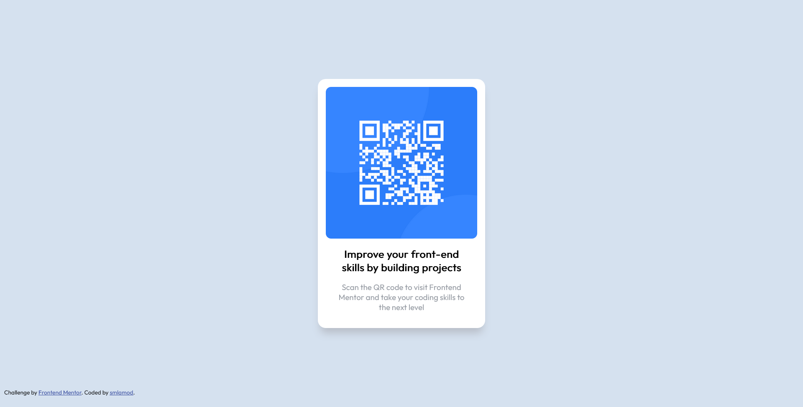

# Frontend Mentor - QR code component

This is a solution to the [QR code component challenge on Frontend Mentor](https://www.frontendmentor.io/challenges/qr-code-component-iux_sIO_H). Frontend Mentor challenges help you improve your coding skills by building realistic projects.

## Table of contents

- [Frontend Mentor - QR code component](#frontend-mentor---qr-code-component)
  - [Table of contents](#table-of-contents)
  - [Overview](#overview)
    - [Screenshot](#screenshot)
    - [Links](#links)
  - [My process](#my-process)
    - [Built with](#built-with)
    - [What I learned](#what-i-learned)
    - [Useful resources](#useful-resources)
  - [Author](#author)

## Overview

### Screenshot




### Links

- Solution URL: [Add solution URL here](https://your-solution-url.com)
- Live Site URL: [Add live site URL here](https://your-live-site-url.com)

## My process

### Built with

- Semantic HTML5 markup
- CSS custom properties
- Flexbox

### What I learned

I have set up a flexbox container for the card to be horizontally centered, for vertical allignment giving it a 100 view height however made the page overflow.

The browser's useragent proved to give the body a margin of 8px that made the container 16px too big. I have subtracted that value using css `calc()` function to shrink it to remove the scroll bar.

```css
// user agent style sheet
body { 
    display: block;
    margin: 8px;
}

.container {
  height: calc(100vh - 16px);
  display: flex;
  justify-content: center;
  align-items: center;
}
```

### Useful resources

- [W3Schools HTML CSS](https://www.w3schools.com/html/html_css.asp) - I typically work with frontend frameworks in my day job and I needed to refresh myself how to link an external CSS
- [MDN Box Shadow](https://developer.mozilla.org/en-US/docs/Web/CSS/box-shadow) - I needed to lookup how to use CSS box shadow.

## Author

- Website - [smlamod.com](https://smlamod.com)
- Frontend Mentor - [@smlamod](https://www.frontendmentor.io/profile/smlamod)
